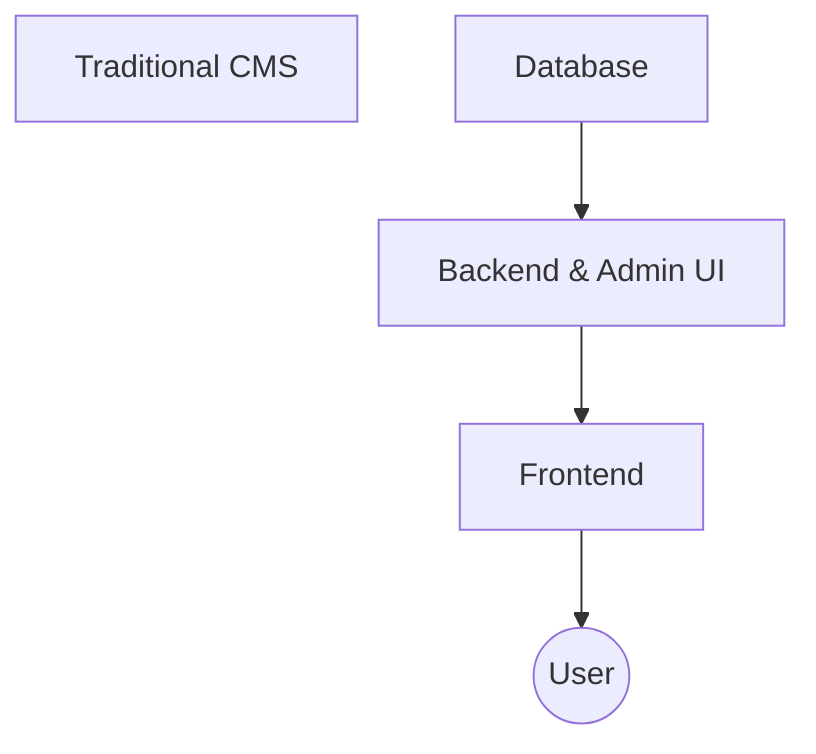
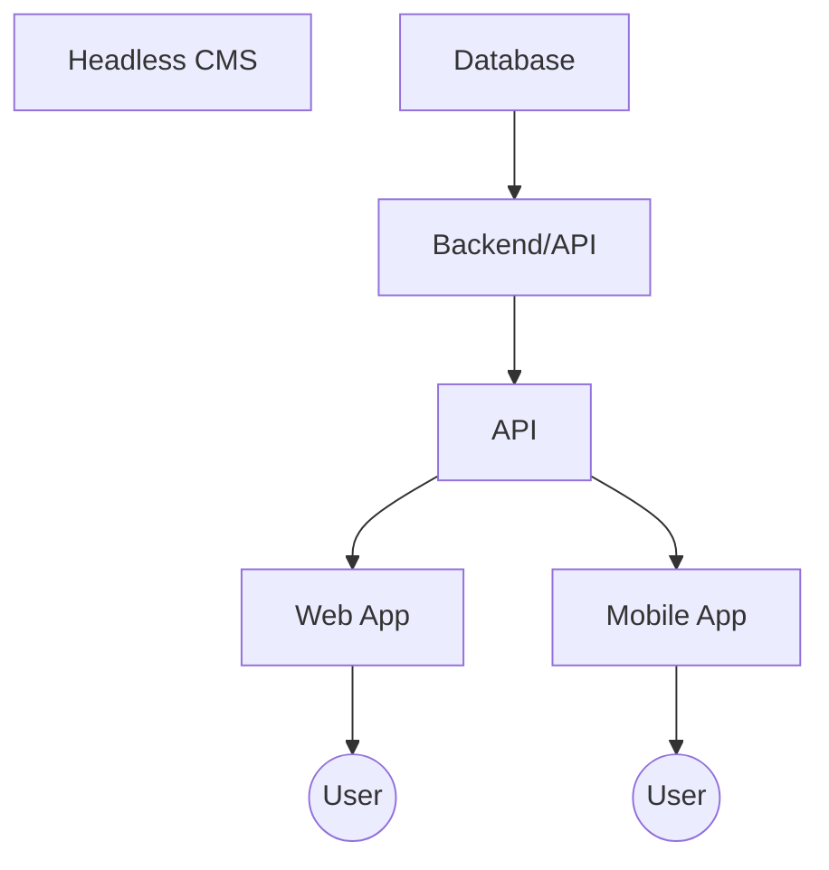

# Headless CMS

> [!NOTE]
> This repository is a opinionated wrapper for [Strapi](https://strapi.io), a headless CMS.

A headless CMS is a content management system that provides a platform for managing content and a API for consuming that content in any frontend application. Unlike traditional CMSs, you are not tied to a specific frontend stack, allowing you to use any technology you want for the frontend (e.g. Vue, React, HTML + Vanilla JS, etc.) while still having a powerful backend to manage your data.

The purpose of this repository is to provide the following features:

- **Opinionated setup**: A personal template for quickly setting up a headless CMS.
- **Container image**: Strapi does not offer a container image so this template provides a Dockerfile to build an opinionated container image for Strapi.
- **Security**: Security scans are performed on the template to ensure that vulnerabilities are identified and addressed continuously.
- **Open-source**: This template uses open-source and community-supported projects to ensure longevity and flexibility.

## Usage

You can run this template as a Node.js application or as a containerized service.

### Node.js

**Requirements:**

- Node.js (`v22.14.0`)
- npm (pnpm is not supported)

```bash
npm install           # Install dependencies
npm run build         # Build the admin panel
npm run dev           # Start Strapi in development mode (http://localhost:1337)
# or
npm run start         # Start Strapi in production mode
```

### Docker

**Requirements:**

- Docker
- Docker Compose (optional)

**Quick start:**

```bash
docker build -t cms .
docker run --name cms -p 1337:1337 -e NODE_ENV=development -e APP_KEYS=<your-base64-app-keys> cms
```

- Replace `<your-base64-app-keys>` with a base64-encoded secret key (e.g. `node -e "console.log(Buffer.from('your-secret-key').toString('base64'))"`).

**With Docker Compose:**

```bash
docker-compose up
```

## FAQ

### What is a Headless CMS?

A traditional CMS manages both backend (data, logic) and frontend (UI), making it harder to decouple content from presentation.



A headless CMS, like Strapi, only manages the backend and exposes content via an API. You can use any frontend technology to consume the API.



In summary: A headless CMS lets you manage content in one place and deliver it anywhere, using any frontend framework you prefer.

## Learn more

- [Strapi documentation](https://docs.strapi.io)
- [Strapi resource center](https://strapi.io/resource-center)
- [Strapi tutorials](https://strapi.io/tutorials)
- [Strapi blog](https://strapi.io/blog)
- [Changelog](https://strapi.io/changelog)
